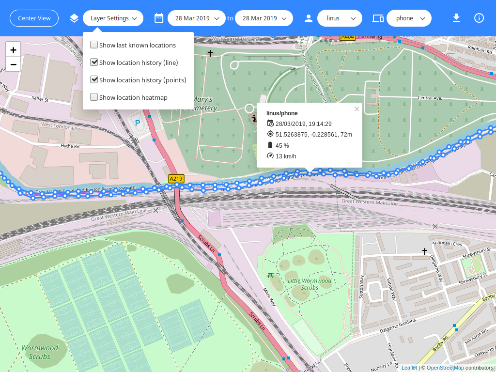
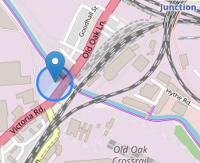
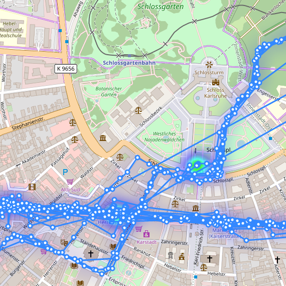
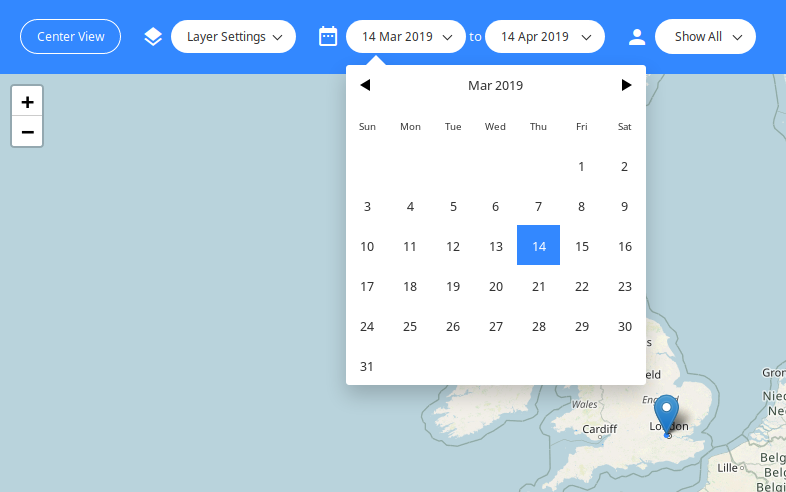
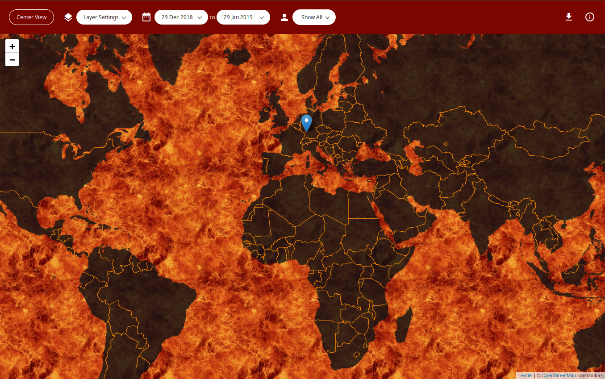

# OwnTracks UI

> A modern web interface for OwnTracks made with Vue.js


<p style="text-align: center;">
  
</p>

## Introduction

This is a web interface for [OwnTracks](https://github.com/owntracks/recorder), intended to replace the various web pages shipping with the recorder. OwnTracks UI uses Vue.js under the hood.

## Installation

### Manual install

Clone the repository and copy `index.html` and the `static/` directory to your server's webroot. The API is expected to be reachable under the same domain as the web interface.

### Docker

You can launch directly via Docker run like this:
```console
$ docker run -d -p 80:80 -e SERVER_HOST=otrecorder-host -e SERVER_PORT=otrecorder-port owntracks/frontend
```

Or you can use `docker-compose` (if you also run the OwnTracks Recorder with the default compose config, and the service is named `otrecorder`):

```yaml
version: '3'

services:
  owntracks-ui:
    image: owntracks/frontend
    ports:
      - 80:80
    environment:
      - SERVER_HOST=otrecorder
      - SERVER_PORT=8083
    restart: unless-stopped
```

## Features

- Enable or disable multiple layers:

  - Last known (i.e. live) locations:

    - Accuracy visualization (circle)
    - Device friendly name and icon
    - Detailed information (if available): time, lat, lon, height, battery and speed

  - Location history (data points, line or both)
  - Location heatmap
  - Button to quickly fit all shown objects on the map into view

- Display data in a specific date range
- Filter by user and device
- Customizable:

  - UI color
  - Default start and end date
  - Map:

    - Tile server
    - Max zoom
    - Default position and zoom
    - Heatmap colors, radius and blur

## Screenshots

_Click to enlarge._

<a href="docs/images/live.png" target="_blank"></a>
<a href="docs/images/multiple.png" target="_blank"></a>
<a href="docs/images/date-selection.png" target="_blank"></a>
<a href="docs/images/heatmap.png" target="_blank"></a>
<a href="docs/images/customized.png" target="_blank"></a>

## ToDo

- Node.js based development workflow:

  - Webpack
  - Vue SFCs
  - Sass
  - Dependency management with yarn instead of a local copy or unpkg.com

- Add documentation, at least for the config file
- Download data for selected date range, user and device as JSON

## Contributing

Please feel free to open an issue and discuss your ideas and report bugs. If you think you can help out with something, open a PR!
